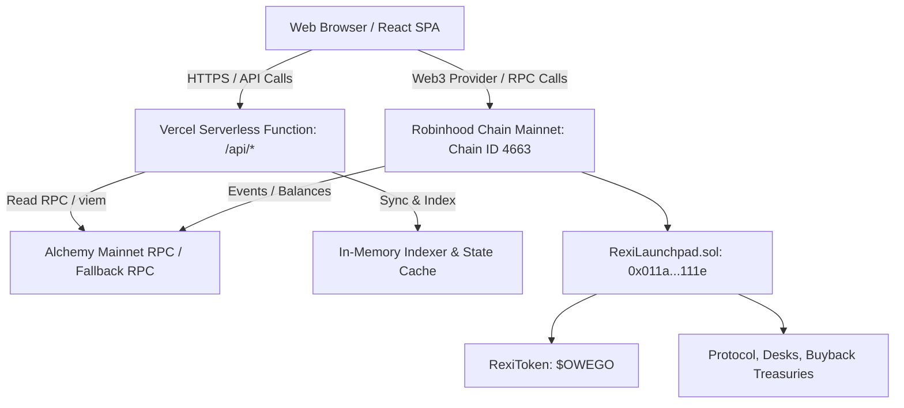

# Rexi Protocol — Technical & Operational Documentation

Welcome to the comprehensive technical documentation for **Rexi**, a token launchpad purpose-built for the **Robinhood Chain Mainnet** (`Chain ID: 4663`).

---

## Table of Contents
1. [Executive Summary](#1-executive-summary)
2. [Live Mainnet Deployments & Proofs](#2-live-mainnet-deployments--proofs)
3. [Architecture & System Design](#3-architecture--system-design)
4. [Token & Dividend Economics](#4-token--dividend-economics)
5. [Smart Contract Mechanics (`RexiLaunchpad.sol`)](#5-smart-contract-mechanics-rexilaunchpadsol)
6. [Backend Indexer & Serverless Architecture](#6-backend-indexer--serverless-architecture)
7. [API Reference](#7-api-reference)
8. [Local Development & Testing](#8-local-development--testing)
9. [Operational Playbook & Workflows](#9-operational-playbook--workflows)
10. [Security Model & Invariants](#10-security-model--invariants)

---

## 1. Executive Summary

Rexi enables anyone to launch an ERC-20 token whose holders continuously accrue real-world and crypto dividends (such as **Apple Stock**, **Tesla Stock**, **Wrapped Ether**, or **Global Dollar**). 

### Core Value Proposition
- **Passive Dividend Yield**: Holders don't need to stake or lock tokens. Holding the token automatically entitles them to proportional reward payouts.
- **Stock-Token Backing**: Direct integration with Robinhood canonical stock tokens ($AAPL, $TSLA) and liquid assets ($WETH, $USDG).
- **Pro-Rata & Fair**: Rewards are streamed at point-of-transfer using accumulator accounting ($O(1)$ transfer hook updates, zero looped gas costs).
- **100% Free Production Infrastructure**: Unified Next-Gen deployment on Vercel utilizing Serverless Express functions and high-throughput RPC indexers.

---

## 2. Live Mainnet Deployments & Proofs

All contracts are live, immutable, and verified on **Robinhood Chain Mainnet**:

| Parameter | Details |
| :--- | :--- |
| **Network Name** | **Robinhood Chain Mainnet** |
| **Chain ID** | `4663` (`0x1237`) |
| **Native Gas Token** | `ETH` |
| **Canonical Launchpad** | [`0x011a50Bd4Ac29c90513728da693E69cAB678111e`](https://explorer.chain.robinhood.com/address/0x011a50Bd4Ac29c90513728da693E69cAB678111e) |
| **Launchpad Deploy Tx** | [`0xd36938865405dbc0dfdd4675a2a7117c8b50fa7ff09a492485080353958805bd`](https://explorer.chain.robinhood.com/tx/0xd36938865405dbc0dfdd4675a2a7117c8b50fa7ff09a492485080353958805bd) (Block `65303659`) |
| **Protocol Treasury (5%)** | [`0xa5e7d6C189b37D9293908E0A28Da4D65d65a7f7A`](https://explorer.chain.robinhood.com/address/0xa5e7d6C189b37D9293908E0A28Da4D65d65a7f7A) |
| **Desks Treasury (10%)** | [`0x913B8D346625736958664C77b0C8Efd3DA2a7bA2`](https://explorer.chain.robinhood.com/address/0x913B8D346625736958664C77b0C8Efd3DA2a7bA2) |
| **Buyback Treasury (10%)** | [`0x8cA71B70C91BD8250073dfDD323b9219Bce6A165`](https://explorer.chain.robinhood.com/address/0x8cA71B70C91BD8250073dfDD323b9219Bce6A165) |

### Verified Canonical Reward Assets
| Ticker | Asset Name | Contract Address | Decimals | Category |
| :--- | :--- | :--- | :--- | :--- |
| **$AAPL** | Apple • Robinhood Token | [`0xaF3D76f1834A1d425780943C99Ea8A608f8a93f9`](https://explorer.chain.robinhood.com/address/0xaF3D76f1834A1d425780943C99Ea8A608f8a93f9) | `18` | Stock |
| **$TSLA** | Tesla • Robinhood Token | [`0x322F0929c4625eD5bAd873c95208D54E1c003b2d`](https://explorer.chain.robinhood.com/address/0x322F0929c4625eD5bAd873c95208D54E1c003b2d) | `18` | Stock |
| **$WETH** | Wrapped Ether | [`0x0Bd7D308f8E1639FAb988df18A8011f41EAcAD73`](https://explorer.chain.robinhood.com/address/0x0Bd7D308f8E1639FAb988df18A8011f41EAcAD73) | `18` | Crypto |
| **$USDG** | Global Dollar (Paxos / Robinhood) | [`0x5fc5360D0400a0Fd4f2af552ADD042D716F1d168`](https://explorer.chain.robinhood.com/address/0x5fc5360D0400a0Fd4f2af552ADD042D716F1d168) | `6` | Stablecoin |

### Mainnet Genesis Launch Evidence
* **Genesis Token**: **`$OWEGO`**
* **Token Address**: [`0x65DaF75eef96316C5b38C8D928106Ea371D9a0fA`](https://explorer.chain.robinhood.com/address/0x65DaF75eef96316C5b38C8D928106Ea371D9a0fA)
* **Initial Supply**: `1,000,000 $OWEGO`
* **Creation Tx**: [`0x01452de7...ad87`](https://explorer.chain.robinhood.com/tx/0x01452de773fbd695f65344ce3f6bad7dc31c47331e4fa7de3057ca34c2d2ad87) (Block `65385305`)
* **First Distribution Tx**: [`0xf114f4e2...9b82`](https://explorer.chain.robinhood.com/tx/0xf114f4e21064b78e8e3cd85090ef09ada35073a38652092155d943f984549b82) (Block `65388600`): Distributed `0.0001 WETH`
* **First Claim Tx**: [`0xbc8fa887...6445`](https://explorer.chain.robinhood.com/tx/0xbc8fa8870183354394019a8616fa1b131920b6e9275990529d4432a537f86445) (Block `65388650`): Holder claimed `0.0000675 WETH` (67.5% holder quota)

---

## 3. Architecture & System Design



### Key Components:
1. **Frontend**: Vite + React 19 single-page application. Handles wallet connection (MetaMask / EIP-1193), transaction construction, and live presentation of token catalog and user claimable balances.
2. **Backend API**: Express server running natively in **Vercel Serverless Functions** (`api/index.js` + `server/index.mjs`). Exposes indexing, historical distribution metrics, protocol solvency health, and sync status.
3. **Indexer Engine**: Viem-powered indexer with Alchemy 10-block chunk limit safety, real-time event log ingestion, and contract state caching.
4. **Smart Contracts**: Solidity 0.8.24 contracts (`RexiLaunchpad.sol` and `RexiToken.sol`) implementing $O(1)$ dividend accumulator accounting with transfer hooks.

---

## 4. Token & Dividend Economics

Whenever any creator or project distributes reward tokens (e.g. $WETH, $AAPL, or $USDG) into a Rexi launch, the protocol automatically routes the funds according to fixed basis points:

```
Total Reward Distribution (100% / 10,000 bps)
├── 67.50% (6,750 bps) ──> Token Holders (Pro-rata dividend claim pool)
├── 10.00% (1,000 bps) ──> Desks Treasury
├── 10.00% (1,000 bps) ──> Buyback Treasury
├──  5.00%   (500 bps) ──> Protocol Treasury
└──  7.50%   (750 bps) ──> Platform Operations / Retained Buffer
```

### Dividend Math
When rewards are deposited into `RexiLaunchpad.distribute(address token, uint256 amount)`:
1. **Holder Share Calculation**:
   $$\text{holderAmount} = \frac{\text{amount} \times 6750}{10000}$$
2. **Accumulator Update**:
   $$\Delta \text{accRewardPerToken} = \frac{\text{holderAmount} \times 10^{24}}{\text{totalSupply}}$$
   $$\text{accRewardPerToken}_{\text{new}} = \text{accRewardPerToken}_{\text{old}} + \Delta \text{accRewardPerToken}$$
3. **User Accrual Calculation**:
   For each holder $u$ with balance $B_u$:
   $$\text{accrued} = \frac{B_u \times (\text{accRewardPerToken} - \text{rewardDebt}_u)}{10^{24}}$$
4. **Transfer Hook Preservation**:
   When a user transfers tokens from account $A$ to account $B$, `beforeTokenTransfer` settles and locks accrued rewards for both sender and recipient before balances shift.

---

## 5. Smart Contract Mechanics (`RexiLaunchpad.sol`)

### Interface & Methods
```solidity
interface IRexiLaunchpad {
    // Creates a new token and registers it on the launchpad
    function createLaunch(
        string calldata name,
        string calldata symbol,
        uint256 supply,
        address rewardAsset
    ) external returns (address token);

    // Distributes rewardAsset into the token's dividend pool
    function distribute(address token, uint256 amount) external;

    // Claims accumulated rewards for msg.sender
    function claim(address token) external returns (uint256 payout);

    // View: Unclaimed rewards ready for payout
    function claimable(address token, address holder) external view returns (uint256);

    // ITransferHook: Called by RexiToken before every transfer
    function beforeTokenTransfer(address token, address from, address to, uint256 amount) external;
}
```

---

## 6. Backend Indexer & Serverless Architecture

- **Path**: `server/indexer.mjs`
- **Engine**: Viem public client connected to Robinhood Mainnet RPC.
- **Alchemy Optimization**: Alchemy free-tier limits `eth_getLogs` to 10 blocks (`toBlock - fromBlock <= 9`). The indexer automatically enforces 10-block chunking and adaptive backoff.
- **Cold Boot State Hydration**: Pre-seeded with Mainnet Genesis token `$OWEGO` logs (`block 65385305`), ensuring instant sub-millisecond response times even during serverless cold starts.

---

## 7. API Reference

Production Base URL: `https://rexi-launchpad.vercel.app`

### 1. Health Check
- **Endpoint**: `GET /api/health`
- **Description**: Returns backend operational status, active chain ID, and canonical launchpad address.
- **Example Response**:
```json
{
  "status": "ok",
  "service": "Rexi Robinhood Backend API",
  "network": "mainnet",
  "chainId": 4663,
  "launchpad": "0x011a50Bd4Ac29c90513728da693E69cAB678111e",
  "timestamp": "2026-09-17T15:39:15.922Z"
}
```

### 2. Token Catalog & Activity
- **Endpoint**: `GET /api/chain/launches`
- **Description**: Returns all indexed launch tokens, reward balances, total distributions, and top performers.

### 3. Launch Details
- **Endpoint**: `GET /api/chain/launches/:token`
- **Description**: Returns detailed metrics and historical distribution events for a specific token address.

### 4. Financial Activity & Treasury Balances
- **Endpoint**: `GET /api/chain/activity`
- **Description**: Live accounting ledger showing cumulative payouts, daily dividend volume, and treasury balances for Protocol, Desks, and Buybacks.

### 5. Invariant Solvency Audit
- **Endpoint**: `GET /api/chain/health`
- **Description**: Audits contract backing to verify that launchpad reward balances strictly match cumulative unclaimed dividends.

---

## 8. Local Development & Testing

### Prerequisites
- Node.js >= 20.x
- Foundry (`forge`, `cast`)
- PowerShell 7+ or bash

### Quick Start
```bash
# 1. Install dependencies
npm install

# 2. Run backend API server locally (port 4000)
npm run server

# 3. Run frontend with hot module reloading (port 5173)
npm run dev
```

### Running Smart Contract Security Tests
```bash
forge test --match-contract RexiLaunchpadSecurityTest -vvv
```

---

## 9. Operational Playbook & Workflows

### How to Create a New Token Launch
1. Navigate to **[rexi-launchpad.vercel.app](https://rexi-launchpad.vercel.app)**.
2. Connect your wallet (make sure it's on Robinhood Chain Mainnet, Chain ID `4663`).
3. Go to the **Launch Token** tab.
4. Enter the Token Name, Ticker Symbol, Total Supply, and select the Reward Asset ($AAPL, $TSLA, $WETH, or $USDG).
5. Click **Deploy Launch Token** and confirm the transaction in MetaMask.

### How to Wrap ETH into WETH for Distributions
Because ETH is the native gas asset, distribution requires standard ERC-20 WETH:
```powershell
# Wrap 0.01 ETH into WETH on Robinhood Mainnet
cast send 0x0Bd7D308f8E1639FAb988df18A8011f41EAcAD73 "deposit()" --value 0.01ether --rpc-url https://robinhood-mainnet.g.alchemy.com/v2/YOUR_KEY --private-key $KEY
```

### How to Distribute Rewards
1. Approve the Launchpad to spend your reward token:
   `rewardToken.approve(0x011a50Bd4Ac29c90513728da693E69cAB678111e, amount)`
2. Call `distribute`:
   `launchpad.distribute(tokenAddress, amount)`

---

## 10. Security Model & Invariants

1. **Reentrancy Protection**: All state mutations in `distribute` and `claim` occur before external token transfers, secured with a custom reentrancy lock.
2. **Transfer Hook Authenticity**: Only the token's deployer can set its transfer hook, preventing third parties from redirecting accounting to malicious contracts.
3. **No Liquidity Draining**: The Launchpad cannot transfer any tokens other than the designated `rewardAsset` explicitly deposited for that launch.
4. **Zero Float Drift**: `totalRewardDeposited == holderQuota + protocolQuota + desksQuota + buybackQuota + opsQuota` is preserved across all calculations.
